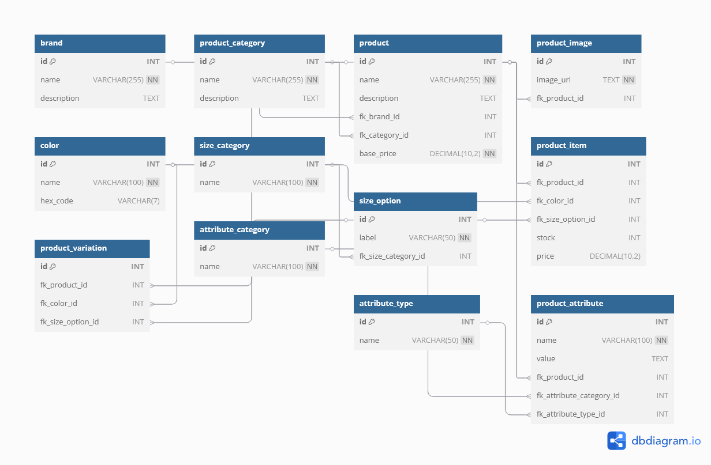

# E-commerce-group-project

# ERD Image

# 🛍️ E-Commerce Database Design

This project contains the database schema and sample data for a comprehensive e-commerce platform. Designed as part of a peer group assignment, it showcases proper relational modeling using SQL.

## 📦 Features

- Well-structured Entity-Relationship Diagram (ERD)
- Support for product variations (size, color)
- Categorized attributes and product types
- Extensible design for real-world e-commerce needs

## 📁 Contents

- `ecommerce.sql` – Contains the full database schema and sample data inserts

## 🧱 Tables Included

- `brand` – Stores brand information
- `product_category` – Groups products by type (e.g. clothing, electronics)
- `product` – Core product details
- `product_item` – Variants of products that are purchasable (e.g. size, color)
- `color` – Available colors for products
- `size_category` & `size_option` – For managing different size groups
- `product_image` – URLs of product images
- `product_variation` – Links products to their variations
- `product_attribute` – Custom product features (e.g. material, weight)
- `attribute_category` & `attribute_type` – Group and type product attributes

## 🚀 Getting Started

Clone the repo or download `ecommerce.sql`
